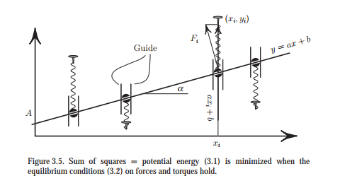
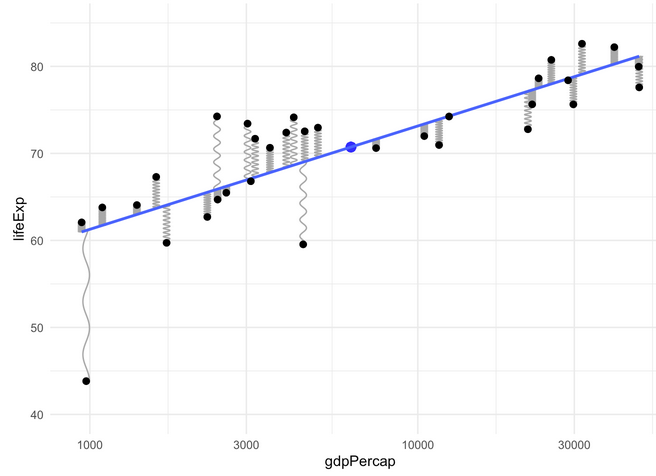

# ggsprings

<!-- badges: start -->
[](https://lifecycle.r-lib.org/articles/stages.html#experimental)
<!-- badges: end -->

`ggsprings` is designed to
implement an extension of `geom_path` which draws paths as springs instead of straight lines.
Aside from possible artistic use, the main impetus for this is to draw points connected by springs,
with properties of length, diameter and tension. The initial code for this comes from
[ggplot2: Elegant Graphics for Data Analysis (3e), Ch. 21](https://ggplot2-book.org/ext-springs)

A leading example is to illustrate how least squares regression
is "solved" by connecting data points to a rod, where the springs are constrained to be vertical.
The mathematics behind this are well-described in this [Math Stackexchange post](https://math.stackexchange.com/questions/2369673/proving-linear-regression-by-using-physical-springs-model),
where the least squares estimates of intercept and slope are shown to be the equilibrium position that minimized the sum of forces
and torques exerted by springs.



If the springs are allowed to be free, the physical solution is the major PCA axis.


How to do this is described in the `ggplot2` book, https://ggplot2-book.org/ext-springs.
The current version here was copied/pasted from the book.

A blog post by Joshua Loftus, [Least squares by springs](https://joshualoftus.com/posts/2020-11-23-least-squares-as-springs/least-squares-as-springs.html)
illustrates this, citing [code from Thomas Lin Pederson](https://twitter.com/thomasp85/status/1331338379636649986).
Code to reproduce the first example is contained in `examples/springs.R` and `examples/gapminder-ex.R`.

### Illustrations

These images show the intent of  `ggsprings` package.

**Least squares regression**

A plot of `lifeExp` vs. `gdpPercap` from the `gapminder` data, with `gdpPercap` on a log10 scale, using the code in the `examples/` folder.
Springs are connected between the observed value `y = lifeExp` and the fitted value on the regression line, `yend = yhat`, computed
with `predict()` for the linear model.
`tension` was set to `5 + (lifeExp - yhat)^2)`.
Code for this is in [examples/gapminder-ex.R](examples/gapminder-ex.R)

```
spring_plot <- simple_plot +
  geom_spring(aes(x = gdpPercap,
                  xend = gdpPercap,
                  y = lifeExp,
                  yend = yhat,
                  diameter = diameter,
                  tension = tension), color = "darkgray") +
  stat_smooth(method = "lm", se = FALSE) +
  geom_point(size = 2)

spring_plot
```

{width=60%}

**Principal components analysis**

In PCA, the first principal component maximizes the variance of the linear combination, or equivalently,
minimizes the sum of squares of **perpendicular** distances of the points to the line.


{width=60%}

**Animated version**

This [StatsExchange post](https://stats.stackexchange.com/questions/2691/making-sense-of-principal-component-analysis-eigenvectors-eigenvalues/140579#140579)
show an animation of the process of fitting PCA by springs.

It doesn't actually draw springs, but it gets the animation right. You can see that the forces of the
springs initially produce large changes in the fitted line, these cause the line to swing back and forth
across it's final position, and shortly the forces begin to balance out.

This animation is written in Matlib, using the code in [pca_animmation.m](https://gist.github.com/anonymous/7d888663c6ec679ea65428715b99bfdd).


## Installation

You can install the current version of `ggsprings` from this repo,

```
remotes::install.github("friendly/ggsprings")
```

## TODO

* Finish documenting the package. I don't quite know how to document a `ggproto` or to use `@inheritParams` for ggplot2 extensions. Add some more examples illustrating spring aesthetics and
features.

* Use the package to re-create the [gapminder example](examples/gapminder-ex.R).

* Try to use `gganimate` for an animated example.

* Make a hex logo

* Write a vignette explaining the connection betweem least squares and springs better.


## Example

Some basic examples top show what is working:


```{r}
library(ggsprings)
library(ggplot2)
library(tibble)
#library(dplyr)

set.seed(421)
df <- tibble(
  x = runif(5, max = 10),
  y = runif(5, max = 10),
  xend = runif(5, max = 10),
  yend = runif(5, max = 10),
  class = sample(letters[1:2], 5, replace = TRUE)
)

ggplot(df) +
  geom_spring(aes(x = x, y = y,
                  xend = xend, yend = yend,
                  color = class),
              linewidth = 2) 


# Using tension and diameter as aesthetics


df <- tibble(
  x = runif(5, max = 10),
  y = runif(5, max = 10),
  xend = runif(5, max = 10),
  yend = runif(5, max = 10),
  class = sample(letters[1:2], 5, replace = TRUE),
  tension = runif(5),
  diameter = runif(5, 0.5, 1.5)
)

ggplot(df, aes(x, y, xend = xend, yend = yend)) +
  geom_spring(aes(tension = tension,
                  diameter = diameter,
                  color = class),
              linewidth = 1.2) 
```

## Related 

* An [interactive demo](https://www.desmos.com/calculator/90vaqtqpx6) by Trey Goesh allows you to 
visualize the effect of moving points, changing spring parameters, etc.
