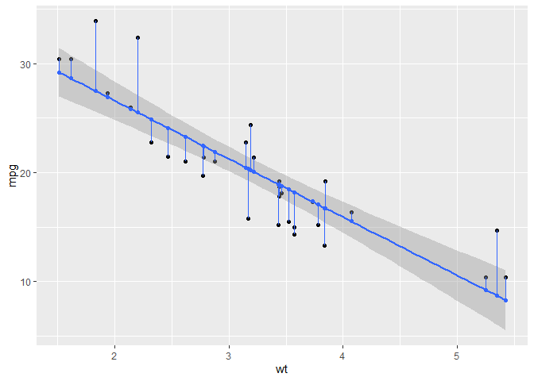
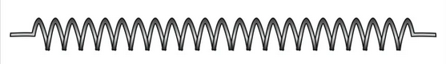
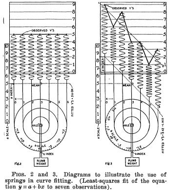
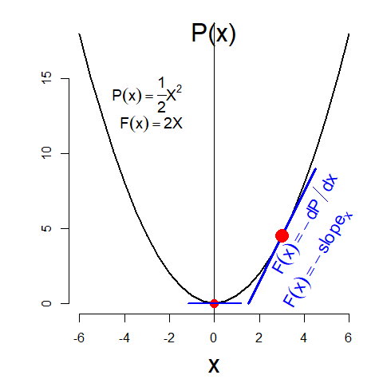
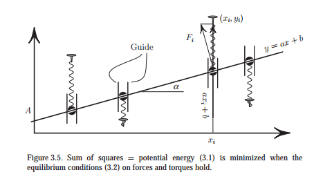
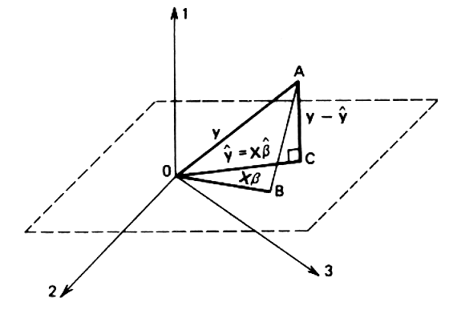
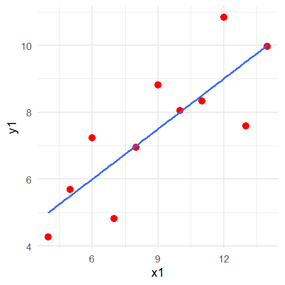
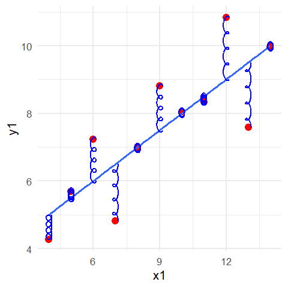
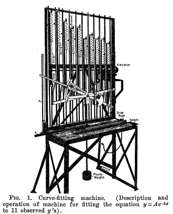
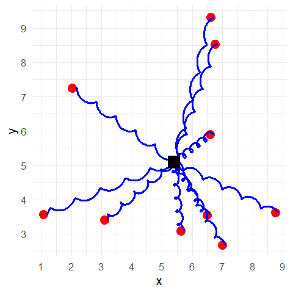

- [ggsprings](#ggsprings)
  - [Illustrations](#illustrations)
  - [Installation](#installation)
  - [TODO](#todo)
  - [What’s inside](#whats-inside)
    - [create_spring.R](#create_springr)
    - [StatSpring.R](#statspringr)
    - [GeomSpring.R](#geomspringr)
    - [geom_spring.R (contains
      `stat_spring()`)](#geom_springr-contains-stat_spring)
    - [StatSmoothFit](#statsmoothfit)
  - [Example](#example)
- [Packaging](#packaging)
- [Vignettes](#vignettes)
  - [vignettes/least-squares.Rmd](#vignettesleast-squaresrmd)
  - [Introduction](#introduction)
    - [A mechanical solution](#a-mechanical-solution)
    - [Early history](#early-history)
  - [Hooke’s Law, potential energy and
    force](#hookes-law-potential-energy-and-force)
    - [Linear springs](#linear-springs)
    - [Functions, energy, force](#functions-energy-force)
  - [Mean of a sample](#mean-of-a-sample)
    - [Demonstration using springs](#demonstration-using-springs)
  - [Bivariate centroid](#bivariate-centroid)
    - [Animate this?](#animate-this)
  - [Least squares regression](#least-squares-regression)
    - [Geometric solution](#geometric-solution)
    - [Example](#example-1)
  - [What’s missing](#whats-missing)
    - [Smoothing methods & families](#smoothing-methods--families)
  - [References](#references)
  - [Related](#related)

<!-- README.md is generated from README.Rmd. Please edit that file -->
<!-- badges: start -->

[](https://lifecycle.r-lib.org/articles/stages.html#experimental)
<!-- badges: end -->

# ggsprings

`ggsprings` is designed to implement an extension of `geom_path` which
draws paths as springs instead of straight lines. Aside from possible
artistic use, the main impetus for this is to draw points connected by
springs, with properties of length, diameter and tension. The initial
code for this comes from [ggplot2: Elegant Graphics for Data Analysis
(3e), Ch. 21: A Case Study
(springs)](https://ggplot2-book.org/ext-springs)

A leading example is to illustrate how least squares regression is
“solved” by connecting data points to a rod, where the springs are
constrained to be vertical. The mathematics behind this are
well-described in this [Math Stackexchange
post](https://math.stackexchange.com/questions/2369673/proving-linear-regression-by-using-physical-springs-model),
where the least squares estimates of intercept and slope are shown to be
the equilibrium position that minimized the sum of forces and torques
exerted by springs.


If the springs are allowed to be free, the physical solution is the
major PCA axis.

How to do this is described in the `ggplot2` book,
<https://ggplot2-book.org/ext-springs>. The current version here was
copied/pasted from the book.

A blog post by Joshua Loftus, [Least squares by
springs](https://joshualoftus.com/posts/2020-11-23-least-squares-as-springs/least-squares-as-springs.html)
illustrates this, citing [code from Thomas Lin
Pederson](https://twitter.com/thomasp85/status/1331338379636649986).
Code to reproduce the first example is contained in `examples/springs.R`
and `examples/gapminder-ex.R`.

### Illustrations

These images show the intent of `ggsprings` package.

**Least squares regression**

A plot of `lifeExp` vs. `gdpPercap` from the `gapminder` data, with
`gdpPercap` on a log10 scale, using the code in the `examples/` folder.
Springs are connected between the observed value `y = lifeExp` and the
fitted value on the regression line, `yend = yhat`, computed with
`predict()` for the linear model. `tension` was set to
`5 + (lifeExp - yhat)^2)`. Code for this is in
[examples/gapminder-ex.R](examples/gapminder-ex.R)

    spring_plot <- simple_plot +
      geom_spring(aes(x = gdpPercap,
                      xend = gdpPercap,
                      y = lifeExp,
                      yend = yhat,
                      diameter = diameter,
                      tension = tension), color = "darkgray") +
      stat_smooth(method = "lm", se = FALSE) +
      geom_point(size = 2)

    spring_plot


**Principal components analysis**

In PCA, the first principal component maximizes the variance of the
linear combination, or equivalently, minimizes the sum of squares of
**perpendicular** distances of the points to the line.


**Animated version**

This [StatsExchange
post](https://stats.stackexchange.com/questions/2691/making-sense-of-principal-component-analysis-eigenvectors-eigenvalues/140579#140579)
show an animation of the process of fitting PCA by springs.

It doesn’t actually draw springs, but it gets the animation right. You
can see that the forces of the springs initially produce large changes
in the fitted line, these cause the line to swing back and forth across
it’s final position, and shortly the forces begin to balance out.

This animation is written in Matlib, using the code in
[pca_animmation.m](https://gist.github.com/anonymous/7d888663c6ec679ea65428715b99bfdd).


## Installation

You can install the current version of `ggsprings` from this repo,

    remotes::install.github("friendly/ggsprings")

## TODO

- Finish documenting the package. I don’t quite know how to document a
  `ggproto` or to use `@inheritParams` for ggplot2 extensions. Add some
  more examples illustrating spring aesthetics and features.

- Use the package to re-create the [gapminder
  example](examples/gapminder-ex.R).

- Try to use `gganimate` for an animated example.

- Make a hex logo

- \[begun\] Write a vignette explaining the connection between least
  squares and springs better. In particular,

  - Illustrate a sample mean by springs: This is the point where
    positive and negative deviations sum to zero
    $\Sigma (x - \bar{x}) = 0$, and also minimizes the sum of squares,
    $\Sigma (x - \bar{x})^2$.
  - Illustrate least squares regression in relation to the the normal
    equations,

------------------------------------------------------------------------

## What’s inside

### create_spring.R

``` r
# https://ggplot2-book.org/ext-springs

#' Create a spring
#'
#' @importFrom rlang abort
#' @param x      starting X coordinate
#' @param y      starting Y coordinate
#' @param xend   ending X coordinate
#' @param yend   ending Y coordinate
#' @param diameter diameter of spring
#' @param tension  tension of spring
#' @param n      number of points betwee start and end
#'
#' @return A data frame of x, y coordinates
#' @export
#'
#' @examples
#' spring <- create_spring(
#' x = 4, y = 2, xend = 10, yend = 6,
#' diameter = 2, tension = 0.6, n = 50
#' )
#'
#' ggplot(spring) +
#'   geom_path(aes(x = x, y = y)) +
#'   coord_equal()


create_spring <- function(x,
                          y,
                          xend,
                          yend,
                          diameter = 1,
                          tension = 0.75,
                          n = 50) {

  # Validate the input arguments
  if (tension <= 0) {
    rlang::abort("`tension` must be larger than zero.")
  }
  if (diameter == 0) {
    rlang::abort("`diameter` can not be zero.")
  }
  if (n == 0) {
    rlang::abort("`n` must be greater than zero.")
  }

  # Calculate the direct length of the spring path
  length <- sqrt((x - xend)^2 + (y - yend)^2)

  # Calculate the number of revolutions and points we need
  n_revolutions <- length / (diameter * tension)
  n_points <- n * n_revolutions

  # Calculate the sequence of radians and the x and y offset values
  radians <- seq(0, n_revolutions * 2 * pi, length.out = n_points)
  x <- seq(x, xend, length.out = n_points)
  y <- seq(y, yend, length.out = n_points)

  # Create and return the transformed data frame
  data.frame(
    x = cos(radians) * diameter/2 + x,
    y = sin(radians) * diameter/2 + y
  )
}

if(FALSE) {
  spring <- create_spring(
    x = 4, y = 2, xend = 10, yend = 6,
    diameter = 2, tension = 0.6, n = 50
  )

  ggplot(spring) +
    geom_path(aes(x = x, y = y)) +
    coord_equal()
}
```

### StatSpring.R

``` r
#' @name ggSpring
#'
#' @title ggSprings extensions to ggplot2
#' @format NULL
#' @usage NULL
#' @rdname Spring_protos
#' @export

StatSpring <- ggproto("StatSpring", Stat,

    setup_data = function(data, params) {
      if (anyDuplicated(data$group)) {
        data$group <- paste(data$group, seq_len(nrow(data)), sep = "-")
      }
      data
    },

    compute_panel = function(data, scales, n = 50) {
      cols_to_keep <- setdiff(names(data), c("x", "y", "xend", "yend"))
      springs <- lapply(seq_len(nrow(data)), function(i) {
        spring_path <- create_spring(
          data$x[i],
          data$y[i],
          data$xend[i],
          data$yend[i],
          data$diameter[i],
          data$tension[i],
          n
        )
        cbind(spring_path, unclass(data[i, cols_to_keep]))
      })
      do.call(rbind, springs)
    },

    required_aes = c("x", "y", "xend", "yend"),
    optional_aes = c("diameter", "tension")
)
```

### GeomSpring.R

[Documentation Q&A
from](https://github.com/ggplot2-extenders/ggplot-extension-club/discussions/83#discussioncomment-12480523)
@friendly and @teunbrand

> I don’t quite know how to document a ggproto

They are usually accompanied by @export, @format NULL and @usage NULL
roxygen tags and refer with @rdname to a pretty generic piece of
documentation stating that these are ggproto classes used for extending
ggplot2 and are not intended to be used by users directly. An example of
that from one of my extensions can be found here:
<https://github.com/teunbrand/ggh4x/blob/main/R/ggh4x_extensions.R>

``` r
# https://ggplot2-book.org/ext-springs#creating-the-geom

#' @name ggSpring
#'
#' @title ggSprings extensions to ggplot2
#' @format NULL
#' @usage NULL
#' @importFrom rlang `%||%`
#' @rdname Spring_protos
#' @export

GeomSpring <- ggproto("GeomSpring", Geom,

    # Ensure that each row has a unique group id
    setup_data = function(data, params) {
      if (is.null(data$group)) {
        data$group <- seq_len(nrow(data))
      }
      if (anyDuplicated(data$group)) {
        data$group <- paste(data$group, seq_len(nrow(data)), sep = "-")
      }
      data
    },

    # Transform the data inside the draw_panel() method
    draw_panel = function(data,
                          panel_params,
                          coord,
                          n = 50,
                          arrow = NULL,
                          lineend = "butt",
                          linejoin = "round",
                          linemitre = 10,
                          na.rm = FALSE) {

      # Transform the input data to specify the spring paths
      cols_to_keep <- setdiff(names(data), c("x", "y", "xend", "yend"))

      # Set default for tension, diameter if not supplied
      # TODO: add a weight aesthetic, defaulting to, say, 0.025 to allow weighted least squares
      data$diameter <- data$diameter %||% (.025 * abs(min(data$x) - max(data$x)))
      data$springlength <- sqrt((data$x - data$xend)^2 + (data$y - data$yend)^2)
      data$tension <-  data$tension %||% (1 * data$springlength)

      springs <- lapply(seq_len(nrow(data)), function(i) {
        spring_path <- create_spring(
          data$x[i],
          data$y[i],
          data$xend[i],
          data$yend[i],
          data$diameter[i],
          data$tension[i],
          n
        )
        cbind(spring_path, unclass(data[i, cols_to_keep]))
      })
      springs <- do.call(rbind, springs)

      # Use the draw_panel() method from GeomPath to do the drawing
      GeomPath$draw_panel(
        data = springs,
        panel_params = panel_params,
        coord = coord,
        arrow = arrow,
        lineend = lineend,
        linejoin = linejoin,
        linemitre = linemitre,
        na.rm = na.rm
      )
    },

    # Specify the default and required aesthetics
    required_aes = c("x", "y", "xend", "yend"),
    default_aes = aes(
      colour = "black",
      linewidth = 0.5,
      linetype = 1L,
      alpha = NA,
      # By marking these as NULL, we mark them as optional
      diameter = NULL,
      tension = NULL
    )
)
```

### geom_spring.R (contains `stat_spring()`)

[Documentation Q&A
from](https://github.com/ggplot2-extenders/ggplot-extension-club/discussions/83#discussioncomment-12480523)
@friendly and @teunbrand

> to use @inheritParams for ggplot2 extensions

If you’re going for a geom_spring(), you can use something like
@inheritParams ggplot2::geom_path or other geom that maximises overlap
between arguments.

``` r
# constructors
# https://ggplot2-book.org/ext-springs#a-constructor
#
# Note: So tension and diameter are implemented as aesthetics, not parameters.
# By including them as optional aesthetics, we're making sure that any geom_spring(diameter, tension) is passed down
# as an unmapped/static aesthetic. Because they are aesthetics and not parameters, they don't need to be in the arguments
# of geom_spring() and for that reason don't need to be documented with #' @param.

#' Connect observations with springs
#'
#' \code{geom_spring} is similar to \code{\link[ggplot2]{geom_path}} in that it connects points,
#' but uses a spring instead of a line.
#'
#' @inheritParams ggplot2::geom_path
#' @param n Number of points
#'
#' @section Aesthetics:
#' geom_spring understands the following aesthetics (required aesthetics are in bold):
#'
#' - **x**
#' - **y**
#' - **xend**
#' - **yend**
#' - diameter
#' - tension
#' - color
#' - linewidth
#' - linetype
#' - alpha
#' - lineend
#'
#' The additional aesthetics are explained below:
#' \describe{
#'   \item{diameter}{Diameter of the spring, i.e., the diameter of a circle
#'   that is stretched into a spring shape.}
#'   \item{tension}{Spring tension constant. This is calibrated as the total
#'   distance moved from the start point to the end point, divided by the size
#'   of the generating circle.}
#' }
#'
#' @importFrom ggplot2 layer
#'
#' @return A ggplot2 layer
#' @export
#'
#' @examples
#' # None yet
geom_spring <- function(mapping = NULL,
                        data = NULL,
                        stat = "identity",
                        position = "identity",
                        ...,
                        n = 50,
                        arrow = NULL,
                        lineend = "butt",
                        linejoin = "round",
                        na.rm = FALSE,
                        show.legend = NA,
                        inherit.aes = TRUE) {
  layer(
    data = data,
    mapping = mapping,
    stat = stat,
    geom = GeomSpring,
    position = position,
    show.legend = show.legend,
    inherit.aes = inherit.aes,
    params = list(
      arrow = arrow,
      lineend = lineend,
      linejoin = linejoin,
      na.rm = na.rm,
      ...
    )
  )
}

#' Spring stat
#'
#' @inheritParams ggplot2::geom_path
#' @importFrom ggplot2 layer
#  @param mapping
#  @param data
#' @param geom     The \code{geom} used to draw the spring segment
#  @param position
#  @param ...
#' @param diameter Diameter of the spring, i.e., the diameter of a circle that is stretched into a spring shape.
#' @param tension  Spring tension constant. This is calibrated as the total distance moved from the start point to the end point, divided by the size of the generating circle.
#' @param n        Number of points
#  @param na.rm
#  @param show.legend
#  @param inherit.aes
#'
#' @return A ggplot2 layer
#' @export
#'
#' @examples
#' # None yet
stat_spring <- function(mapping = NULL,
                        data = NULL,
                        geom = "path",
                        position = "identity",
                        ...,
                        diameter = 1,
                        tension = 0.75,
                        n = 50,
                        na.rm = FALSE,
                        show.legend = NA,
                        inherit.aes = TRUE) {
  layer(
    data = data,
    mapping = mapping,
    stat = StatSpring,
    geom = geom,
    position = position,
    show.legend = show.legend,
    inherit.aes = inherit.aes,
    params = list(
      diameter = diameter,
      tension = tension,
      n = n,
      na.rm = na.rm,
      ...
    )
  )
}
```

### StatSmoothFit

``` r
compute_group_smooth_fit <- function(data, scales, method = NULL, formula = NULL,
                           xseq = NULL,
                           level = 0.95, method.args = list(),
                           na.rm = FALSE, flipped_aes = NA){
  
  if(is.null(xseq)){ # predictions based on observations 

  StatSmooth$compute_group(data = data, scales = scales, 
                       method = method, formula = formula, 
                       se = FALSE, n= 80, span = 0.75, fullrange = FALSE,
                       xseq = data$x, 
                       level = .95, method.args = method.args, 
                       na.rm = na.rm, flipped_aes = flipped_aes) |>
      dplyr::mutate(xend = data$x,
                    yend = data$y)
  
  }else{  # predict specific input values
    
  StatSmooth$compute_group(data = data, scales = scales, 
                       method = method, formula = formula, 
                       se = FALSE, n= 80, span = 0.75, fullrange = FALSE,
                       xseq = xseq, 
                       level = .95, method.args = method.args, 
                       na.rm = na.rm, flipped_aes = flipped_aes)   
    
  }
  
}
```

``` r
library(ggplot2)
cars |>
  select(x = speed, y = dist) |>
  compute_group_smooth_fit(method = lm, formula = y~ x) |>
  head()
#>   x     y flipped_aes xend yend
#> 1 4 -1.85          NA    4    2
#> 2 4 -1.85          NA    4   10
#> 3 7  9.95          NA    7    4
#> 4 7  9.95          NA    7   22
#> 5 8 13.88          NA    8   16
#> 6 9 17.81          NA    9   10
```

``` r
StatSmoothFit <- ggplot2::ggproto("StatSmoothFit", 
                                  ggplot2::StatSmooth,
                                  compute_group = compute_group_smooth_fit,
                                  required_aes = c("x", "y"))

aes_color_accent <- GeomSmooth$default_aes[c("colour")]

GeomPointAccent <- ggproto("GeomPointAccent", GeomPoint, 
              default_aes = modifyList(GeomPoint$default_aes, 
                                       aes_color_accent))

GeomSegmentAccent <- ggproto("GeomSegmentAccent", GeomSegment,
                           default_aes = modifyList(GeomSegment$default_aes, 
                                                    aes_color_accent))

GeomSpringAccent <- ggproto("GeomSpringAccent", GeomSpring,
                           default_aes = modifyList(GeomSpring$default_aes,
                                                    aes_color_accent))

layer_smooth_fit <- function (mapping = NULL, data = NULL, stat = StatSmoothFit, geom = GeomPointAccent, position = "identity", 
    ..., show.legend = NA, inherit.aes = TRUE) 
{
    layer(data = data, mapping = mapping, stat = stat, 
        geom = geom, position = position, show.legend = show.legend, 
        inherit.aes = inherit.aes, params = rlang::list2(na.rm = FALSE, 
            ...))
}

stat_smooth_fit <- function(...){layer_smooth_fit(stat = StatSmoothFit, ...)}
geom_smooth_fit <- function(...){layer_smooth_fit(geom = GeomPointAccent, ...)}
geom_residuals <- function(...){layer_smooth_fit(geom = GeomSegmentAccent, ...)}
geom_residual_springs <- function(...){layer_smooth_fit(geom = GeomSpringAccent, ...)}
```

``` r
library(ggsprings)
mtcars %>% 
  ggplot() + 
  aes(x = wt, y = mpg) + 
  geom_point() + 
  geom_smooth(method = "lm") + 
  geom_smooth_fit(method = "lm") + 
  geom_residuals(method = "lm")
```



``` r

# ggwipe::last_plot_wipe_last() + 
#   geom_residual_springs(method = "lm")
  
```

## Example

Some basic examples top show what is working:

``` r
# library(ggsprings)
library(ggplot2)
library(tibble)
#library(dplyr)

set.seed(421)
df <- tibble(
  x = runif(5, max = 10),
  y = runif(5, max = 10),
  xend = runif(5, max = 10),
  yend = runif(5, max = 10),
  class = sample(letters[1:2], 5, replace = TRUE)
)

ggplot(df) +
  geom_spring(aes(x = x, y = y,
                  xend = xend, yend = yend,
                  color = class),
              linewidth = 2) 
```


Using tension and diameter as aesthetics

``` r
df <- tibble(
  x = runif(5, max = 10),
  y = runif(5, max = 10),
  xend = runif(5, max = 10),
  yend = runif(5, max = 10),
  class = sample(letters[1:2], 5, replace = TRUE),
  tension = runif(5),
  diameter = runif(5, 0.25, 0.75)
)

ggplot(df, aes(x, y, xend = xend, yend = yend)) +
  geom_spring(aes(tension = tension,
                  diameter = diameter,
                  color = class),
              linewidth = 1.2) 
```


# Packaging

``` r
devtools::check(".")
devtools::install(pkg = ".", upgrade = "never") 
```

# Vignettes

## vignettes/least-squares.Rmd

<!--
```{=html}
<script id="MathJax-script" async src="https://cdn.jsdelivr.net/npm/mathjax@3/es5/tex-mml-chtml.js"></script>
<script>
MathJax = {
  tex: {
    inlineMath: [['$', '$'], ['\\(', '\\)']]
  },
  svg: {
    fontCache: 'global'
  }
};
</script>
```
-->



## Introduction

The method of least squares fitting is remarkable in its versatility. It
grew out of practical problems in astronomy (the orbits of planets,
librations of the moon) and geodesy (finding the “shape” of the earth),
where astronomers and mathematicians sought to find a way to combine a
collection of fallible observations (angular separation between stars)
into a a single “best” estimate. Some of the best names in mathematics
are associated with this discovery: Newton, Laplace, Legendre, Gauss.
@Stigler1981 recounts some of this history.

It’s original application was to justify the use of the arithmetic
average $\bar{x}$ as the value that gave the smallest sum of squares of
errors $\text{SSE} =\Sigma (x - \bar{x})^2$, but the same principle
gives solutions for linear least squares regression, multiple
regression, smoothing splines and non-linear models, all the way to
exploratory factor analysis.

As a mathematical method of estimation, least squares is also remarkably
versatile in the variety of methods of proof that can justify it’s
application. Minimization of the sum of squares of errors can be solved
by calculus, linear algebra or by numerical optimization and even by a
simple geometric argument.

It is the purpose of this vignette to show how least squares problems
can also be solved by the physics of springs and a bit of the history of
this idea. No need to invoke a function minimization algorithm, invert a
matrix, or solve a system of equations. Just connect your observations
to what you want to estimate with springs, and *bingo!*, let the springs
give the answer.

### A mechanical solution

Among the earliest physical realizations of solving least squares
problems by springs, @GainesPalphrey:1932 included the following figures
to illustrate a remarkable physical device for fitting a linear relation
$y = a + b x$ to observations. In the left figure, seven uniform springs
placed at $x = 0 : 6$ are suspended from the observed values $y_i = 5$
and from these light bands are connected to a heavy stepped plumb wheel.
The dotted horizontal line represented the least squares fit; it goes
through the mean $\bar{y} = 5$ and has the equation $\hat{y} = 5 + 0 x$.
The number gauge at the left allows one to read the intercept, $a = 5$
and from the scale markings on the wheel one can read the slope,
$b = 0$.

<div class="figure" style="text-align: center">


<p class="caption">
Diagrams to illustrate the use of springs in fitting a linear regression
relation. Left: all observed $y$ values are the same ($y = 5$); right:
$y_i = \{9, 6, 8, 4, 4, 1, 3\}$. The equation of the line can be read
from the scale at the left for the intercept and the scale on the wheel
for the slope.
</p>

</div>

In the figure at the right the $y$ values are
$y_i = \{9, 6, 8, 4, 4, 1, 3\}$ which has the same sum, $\Sigma y = 35$
The dotted fitted line again passes through the mean $\bar{y} = 5$. The
springs connecting the points to the fitted line are stretched or
compressed by their deviations, $e_i = y_i - \hat{y}$, and for
equilibrium these deviations must sum to zero, $\Sigma e_i = 0$. Each
spring stores potential energy proportional to $e_i^2$ and the system is
in equilibrium when the sum of energies, $\Sigma e_i^2$ is at its
minimum.

For this problem, `lm()` gives $\hat{y} = 8.43 - 1.143 \;x$ and these
values can be read approximately from the device.

``` r
x <- 0:6
y <- c(9, 6, 8, 4, 4, 1, 3)
lm(y~x) |> coef()
#> (Intercept)           x 
#>       8.429      -1.143
```

In reaching equilibrium, the weighted wheel is rotated through an angle
proportional to the slope, $b$, whose value is shown on the scale for
the wheel. The intercept is the value shown on the scale at the left for
the line at $x=0$.

Thus, the spring diagram illustrates mechanically the properties of the
least squares solution:

1.  The fitted line passes through the central value $\bar{x}$ at the
    value of the mean $\bar{y}$ of the $y_i$.
2.  The algebraic sum of the deviations from the line is zero,
    $\Sigma e_i = \Sigma (y_i - \bar{y}) = 0$.
3.  The sum of squares of the deviations $\Sigma e_i^2$ is minimum.

### Early history

The idea of a mechanical analog of least squares by springs actually
goes back almost to the initial ideas stated in Gauss’ *Theoria Motus*
\[-@Gauss-1809theoria\], as detailed by @Farebrother1999a. @Donkin-1844
was the first to suggest that in finding the best measure of location
$\tilde{x}$ in a sample, an observation $x_0$ of weight $g$ exerts a
force proportional to $g \cdot (\tilde{x} - x_0)$ and equilibrium
requires $\Sigma g \cdot (\tilde{x} - x_0) = 0$.

Simon Newcomb \[@Newcomb-1873a; @Newcomb-1873b\] shortly extended this
to the problem of finding, by least squares, the best position of a line
describing changes in some astronomical observation which varies
uniformly (linearly) over time. He describes the physical analog as that
of a rigid rod “attracted by each of the points with a force
proportional to the weight of the corresponding observation multiplied
by the distance of the point to the rod” (i.e., residual).

Newcombe’s mechanical model does not refer to springs, but it is
remarkable in that: (a) he recognizes weighted least squares, because
observations may be more or less reliable, and (b) he recognizes the
idea of *influence* on the rotational forces– observations further from
the centroid exert greater influence on the slope of the line.

## Hooke’s Law, potential energy and force

The application of springs to problems in statistics depends on
understanding the physics of springs and physical systems more
generally, using the concepts of potential energy, forces applied by
physical objects and how these can balance in a state of equilibrium.

### Linear springs

A linear spring is the one whose tension is directly proportional to its
length: stretching such a spring to a length $x$ requires the force
$F(x) = k\;x$. Force acts in a given direction, so compressing a spring
requires a force $- k\;x$. This is illustrated in the figure below,
where $x$ indicates the stretching of a spring.

<div class="figure" style="text-align: center">


<p class="caption">
Hooke’s Law for springs. The force required to stretch the spring is
proportional to the extension, $x$, represented by the weights.
*Source*: [Wikipedia](https://en.wikipedia.org/wiki/Hooke%27s_law)
</p>

</div>

Here the multiplier $k$ is a constant (called the Hooke’s constant) that
characterizes a particular spring. A small $k$ means a lax spring, while
a large $k$ means a stiff spring. By convention, the unstretched length
of such a spring is zero.

In the ggSprings package to date, all observations are considered to
have the same, arbitrary spring constant. Allowing these to vary, with a
`weight` aesthetic would be a natural way to implement weighted least
squares.

### Functions, energy, force

A spring is something that acts elastically, meaning that it stores
(potential) energy if you either stretch it or compress it. How much
energy it stores is proportional to the square of the distance it is
stretched or compressed.

$$
P(x) = \frac12 k \; x^2
$$ In this notation, the force exerted by a spring, $F(x)$ can be seen
as the (negative) derivative, or slope at $x$ of potential energy,

$$
F(x) = -\frac{d}{dx} \left( \frac12 k \; x^2 \right)= -k \; x
$$ A spring is at equilibrium when the potential energy is minimized, or
the force exerted is zero. The general relations between mathematics and
physics are shown in the table below \[@Levi2009, p.27\].

| Mathematics | Physics |
|----|----|
| function, $f (x)$ | potential energy, $P(x)$ |
| derivative, $f\prime (x)$ | force, $F(x) = -P\prime(x)$ |
| $\min_x f(x) \implies f\prime (x) = 0$ | equilibrium, $\min_x P(x) \implies F (x) = 0$ |

These relations are illustrated in the figure below, where positive $x$
means the spring is stretched and negative $x$ represents compression.
When the spring is stretched to $x = 3$, the potential energy is
$P(x) = \frac12 (3^2) = 4.5$. The line through $(3, 4.5)$ tangent to the
curve has slope $P^\prime (x) = x = 3$ so the force the spring exerts is
$F(x) = -3$, where the negative sign means a force in the direction of
$x=0$.

<div class="figure" style="text-align: center">


<p class="caption">
Potential energy and force of a spring.
</p>

</div>

The horizontal line through $(0, 0)$, that is, when $x = 0$ illustrates
equilibrium where potential energy is minimized, and the force (slope)
is $F(0) = 0$.

## Mean of a sample

The sample mean has several nice physical analogs, which stem from the
properties that

- the sum of deviations ($e_i$) of observations ($x_i$) from the mean
  $\bar{x}$ equals 0: $\Sigma_i e_i =\Sigma_i ( x_i - \bar{x} ) = 0$.

- the sum of squared deviations is the smallest for any choice of
  $\bar{x} = \min_{\bar{x}} ( x_i - \bar{x} )^2$

### Demonstration using springs

Create a set of observations, sampled randomly on \[1, 10\]

``` r
set.seed(1234)
N <- 8
df <- tibble(
  x = runif(N, 1, 10),
  y = seq(1, N)
)

means <- colMeans(df) 
xbar <- means[1] |> print()
#>     x 
#> 5.176
```

Then, set the tension of the spring to be the absolute value of the
deviation of the observation from the mean.

``` r
df <- df |>
  mutate(tension = abs(x - xbar),
         diameter = 0.2)
```

Then, visualize this with springs. In the call to `geom_spring()` for
this problem, the spring is specified to go from the value of `x` to
`xend = xbar`, while setting `y` and `yend` to the value of `y`. A lot
of code is devoted to making this a pretty figure.

``` r
ggplot(df, aes(x=x, y=y)) +
  geom_point(size = 5, color = "red") +
  geom_segment(x = xbar, xend = xbar,
               y = 1/2,  yend = N + 1/2,
               linewidth = 3) +
  geom_spring(aes(x = x, xend = xbar,
                  y = y, yend = y,
                  tension = tension,
                  diameter = diameter),
              color = "blue",
              linewidth = 1.2) +
  labs(x = "Value (x)",
       y = "Observation number") +
  ylim(0, N+2) +
  scale_y_continuous(breaks = 1:N) +
  annotate("text", x = xbar, y = N + 1,
           label = "Movable\nrod", size = 5,
           lineheight = 3/4) 
```


## Bivariate centroid

For a bivariate sample, $(x_i, y_i)$, the centroid point,
$(\bar{x}, \bar{y})$ is realized physically as the result of attaching
springs between the fixed points and a free, movable point. If we make
the tension on the spring proportional to it’s length or the distance to
the centroid, each point will have potential energy proportional to its
**squared** distance from the movable one, where the forces balance (sum
to zero).

Set this up for a sample of 10 points, uniformly distributed on (1, 10).

``` r
set.seed(1234)
N <- 10
df <- tibble(
  x = runif(N, 1, 10),
  y = runif(N, 1, 10)
)
```

We’ll want to calculate tension in relation to the distance from the
centroid, given by $(\bar{x}, \bar{y})$, so calculate these now as
`xbar`, `ybar`.

``` r
means <- colMeans(df)
xbar <- means[1]; ybar <- means[2]
```

Then, for this example, we set the tension as the distance between the
point and the mean, in the dataframe `df` so it can be used as an
aesthetic in `geom_spring()`.

``` r
df <- df |>
  mutate(tension = sqrt((x - xbar)^2 + (y - ybar)^2),
         diameter = 0.4)
```

Visualize the springs:

``` r
ggplot(df, aes(x=x, y=y)) +
  geom_point(size = 5, color = "red") +
  geom_spring(aes(x = x, xend = xbar,
                  y = y, yend = ybar,
                  tension = tension / 5,
                  diameter = diameter),
              color = "blue",
              linewidth = 1.2) +
  geom_point(x = xbar, y = ybar, 
             size = 7,
             shape = 15,
             color = "black") +
  scale_x_continuous(breaks = 1:10) +
  scale_y_continuous(breaks = 1:10) 
```


### Animate this?

One way to animate this would be to imagine the springs acting one at a
time, sequentially on the position of the moving point, and looping
until nothing changes. Not sure how to program this with `gganimate`.

## Least squares regression

For linear least squares regression, we have a collection of points
$(x_i, y_i)$, and it is desired to fit a “best” line
$y = a + b \times x$ that makes the sum of squares of errors, $$
\text{RSS} (a,b) = \sum_i \; \left[y_i - (a + b \times x_i) \right]^2 = \sum_i e_i^2
$$ as small as possible. The representation by springs is shown in
<!-- @fig-levi-least-sq-springs,  --> @ref(fig:levi-least-sq-springs)
where the observations are drawn as small ovals, connected to the fitted
points on the line $y = a + b \times x$, realized by a rigid rod in the
mechanical analog. The Guides represent vertical channels that force the
springs to work only up or down in the vertical direction.

<div class="figure" style="text-align: center">


<p class="caption">
*Source*: \[@Levi2009, p. 33\]
</p>

</div>

Minimizing the sum of squares of the spring lengths means minimizing the
potential energy of the mechanical system, and consequently the rod is
in equilibrium. This implies that the sum of (vertical) forces $F_i$ is
zero, and that the sum of rotational forces, or torques around the
intercept, $A$ in the diagram is also zero.

Substituting $e_i = y_i - (a + b x_i)$ gives what are recognized as the
“normal equations” for the least squares solution,

or, rearranging terms,

These equations may be more recognizable in matrix form. Letting
$\mathbf{X} = [\mathbf{1},  \mathbf{x}]$ and
$\mathbf{b} = \begin{pmatrix} a \\ b \\ \end{pmatrix}$, we arrive at

from which the matrix solution is $$
\widehat{\mathbf{b}} = ( \mathbf{X}^\top \mathbf{X})^{-1} \; \mathbf{X}^\top \mathbf{y} \; ,
$$

as long as $(\mathbf{X}^\top \mathbf{X})^{-1}$ exists, i.e.,
$\text{det}(\mathbf{X}^\top \mathbf{X}) \ne 0$.

### Geometric solution

It is of interest to see how the solution using springs is equivalent to
a geometric argument. @ref(fig:least-squares-geometry) shows the vector
space representation of a vector \$ of three observations. Any possible
regression line corresponds to a vector $\boldsymbol{\beta} = (a, b)$ in
the dashed plane that represents linear combinations of
$\mathbf{X} = [\mathbf{1}, \mathbf{x}]$. The least squares solution is
that which minimizes the length of the residual vector
$\mathbf{y} - \widehat{\mathbf{y}} = \mathbf{e}$.

<div class="figure" style="text-align: center">


<p class="caption">
Geometrical interpretation of least squares regression. The vector
$\mathbf{y}$ to point A represents the data for three observations
</p>

</div>

From this diagram it can be seen that the residual vector must be
orthogonal to $\mathbf{X} = [\mathbf{1}, \mathbf{x}]$, so,

We can also note that the orthogonality condition,
$\mathbf{X} = [\mathbf{1}, \mathbf{x}] \perp \mathbf{e}$ means that

which are the same as @ref(eq:force) and @ref(eq:torque).

### Example

For a simple example of `geom_springs()` for a regression problem, we
plot the first two variables, `x1, y1` in the `anscombe` data set,
together with the linear regression line.

``` r
simple_plot <-
  ggplot(anscombe,
         aes(x = x1, y = y1)) + 
  geom_point(size = 4, color = "red") +
  geom_smooth(method = lm, formula = y~x, 
              se = FALSE,
              linewidth = 1.4) 
simple_plot
```



The current implementation of `geom_springs()` requires that we fit the
linear model, add the predicted value of `y1` to the dataset and use
that value as `yend` in the call to `geom_spring()`

``` r
model <- lm(y1 ~ x1, data = anscombe)

anscombe <- anscombe |>
  mutate(fitted = predict(model))

simple_plot +
  geom_spring(data=anscombe,
              aes(xend = x1, yend = fitted),
              color = "blue",
              linewidth = 1)
```



Note that `diameter` and `tension` are not specified here. By default,
`geom_spring()` uses 0.025 times the range of `x` for the spring
diameter, and the distance `abs(y - yend)` from the point to the fitted
line as the tension.

**NOTE**: Something is off in the calculation of `diameter` in the
vignette here. This example works more nicely when run in the console.

## What’s missing

For regression problems, it is inconvenient to have to fit the same
model that has been constructed by `geom_smooth()` and add the `fitted`
value to the dataset. The [ggsmoothfit
repo](https://github.com/EvaMaeRey/ggsmoothfit/) provides convienient
functions, `geom_smooth_fit()` and `geom_smooth_residuals()` that
provide some useful methods, and the [README
file](https://github.com/EvaMaeRey/ggsmoothfit/blob/main/README.md)
defines a `GeomSmoothSpring` that has this capability. However, this is
*not* a package that can be installed from GitHub, and the
implementation there depends on another package
[statexpress](https://github.com/EvaMaeRey/statexpress)

One way to simplify spring plots for models is to use `broom::augment()`
for a fitted model to get the data.frame containing all necessary
information.

``` r
broom::augment(model)
#> # A tibble: 11 × 8
#>       y1    x1 .fitted  .resid   .hat .sigma   .cooksd .std.resid
#>    <dbl> <dbl>   <dbl>   <dbl>  <dbl>  <dbl>     <dbl>      <dbl>
#>  1  8.04    10    8.00  0.0390 0.100    1.31 0.0000614     0.0332
#>  2  6.95     8    7.00 -0.0508 0.1      1.31 0.000104     -0.0433
#>  3  7.58    13    9.50 -1.92   0.236    1.06 0.489        -1.78  
#>  4  8.81     9    7.50  1.31   0.0909   1.22 0.0616        1.11  
#>  5  8.33    11    8.50 -0.171  0.127    1.31 0.00160      -0.148 
#>  6  9.96    14   10.0  -0.0414 0.318    1.31 0.000383     -0.0405
#>  7  7.24     6    6.00  1.24   0.173    1.22 0.127         1.10  
#>  8  4.26     4    5.00 -0.740  0.318    1.27 0.123        -0.725 
#>  9 10.8     12    9.00  1.84   0.173    1.10 0.279         1.63  
#> 10  4.82     7    6.50 -1.68   0.127    1.15 0.154        -1.45  
#> 11  5.68     5    5.50  0.179  0.236    1.31 0.00427       0.166
```

Then, the anscombe example can be re-created as follows:

``` r
ans_mod <- lm(y1 ~ x1, data = anscombe)
ans_aug <- broom::augment(ans_mod)

ggplot(ans_aug) +
  aes(x = x1, y = y1) +
  geom_point(size = 4, color = "red") +
  geom_smooth(method = lm, formula = y~x,
              se = FALSE,
              linewidth = 1.4) +
  geom_spring(
            aes(xend = x1, yend = .fitted),
            color = "blue",
            linewidth = 1)
```


### Smoothing methods & families

It is also important to be able to construct spring plots for *any model
method* that can be represented by
`geom_smooth(method = AA, formula = y ~ BB)`, where:

- `method` can be: `lm`, `glm`, `loess` or nearly any other fitting
  function, such as `MASS::rlm` for robust fits or `mgcv::gam` for
  generalized additive models, (**TODO**: Another reason to implement an
  observation `weight` aesthetic param.)

- `formula` can be any model formula involving only `y` and `x`, such as
  `y ~ x` or `y ~ poly(x, 2)` or even `y ~ splines::ns(x, df =)`

For example @GainesPalphrey:1932 actually constructed the machine shown
in the figure @ref{fig:Gaines-fig1} for fitting the relation
$y = A \; e^{-k x}$ This solved a practical agricultural problem:

> Breeders of dairy cattle are accumulating a large body of yearly
> records of production based on the milk yield and fat test of
> individual cows by calendar months. The problem is to measure the rate
> of milk secretion for each cow by fitting the data of the first
> *eleven* full months of lactation with the equation
> $y = A \; e^{-k x}$, in which $y$ is milk-energy yield per day, and
> $x$ is time in months with origin at one month after calving.

<div class="figure" style="text-align: center">


<p class="caption">
A mechanical spring-driven curve fitting machine,
</p>

</div>

For this figure, they say, “When the eleven stops, representing the
observed y’s, are set the machine immediately indicates the fitted $A$
and $k$ constants”.

## References

Using tension and diameter defaults

``` r
set.seed(1234)
N <- 10
df <- tibble(
  x = runif(N, 1, 10),
  y = runif(N, 1, 10)
)

ggplot(df) +
  aes(x = x, y = y,
      xend = mean(x),
      yend = mean(y)) +
  geom_point(size = 5, color = "red") +
  geom_spring(color = "blue",
              linewidth = 1.2) +
  geom_point(aes(x = mean(x), y = mean(y)), 
             size = 7,
             shape = 15,
             color = "black") +
  scale_x_continuous(breaks = 1:10) +
  scale_y_continuous(breaks = 1:10) +
  theme_minimal(base_size = 15) 
```



## Related

- An [interactive demo](https://www.desmos.com/calculator/90vaqtqpx6) by
  Trey Goesh allows you to visualize the effect of moving points,
  changing spring parameters, etc.
