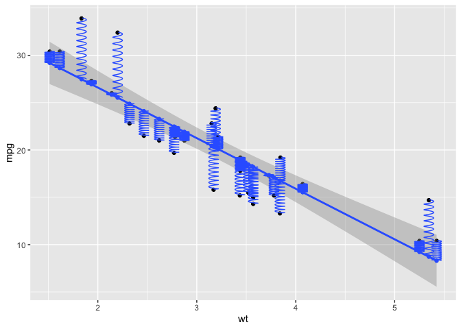

- [ggsprings](#ggsprings)
  - [Illustrations](#illustrations)
  - [Installation](#installation)
  - [TODO](#todo)
  - [What’s inside](#whats-inside)
    - [create_spring.R](#create_springr)
    - [StatSpring.R](#statspringr)
    - [GeomSpring.R](#geomspringr)
    - [geom_spring.R (contains
      `stat_spring()`)](#geom_springr-contains-stat_spring)
    - [StatSmoothFit](#statsmoothfit)
  - [Example](#example)
- [Packaging](#packaging)
- [Vignettes](#vignettes)
  - [vignettes/least-squares.Rmd](#vignettesleast-squaresrmd)
  - [Introduction](#introduction)
  - [Hooke’s Law, potential energy and
    force](#hookes-law-potential-energy-and-force)
    - [Linear springs](#linear-springs)
    - [Functions, energy, force](#functions-energy-force)
  - [Mean of a sample](#mean-of-a-sample)
    - [Demonstration using springs](#demonstration-using-springs)
  - [Bivariate centroid](#bivariate-centroid)
    - [Animate this?](#animate-this)
  - [Least squares regression](#least-squares-regression)
  - [Related](#related)

<!-- README.md is generated from README.Rmd. Please edit that file -->
<!-- badges: start -->

[](https://lifecycle.r-lib.org/articles/stages.html#experimental)
<!-- badges: end -->

# ggsprings

`ggsprings` is designed to implement an extension of `geom_path` which
draws paths as springs instead of straight lines. Aside from possible
artistic use, the main impetus for this is to draw points connected by
springs, with properties of length, diameter and tension. The initial
code for this comes from [ggplot2: Elegant Graphics for Data Analysis
(3e), Ch. 21: A Case Study
(springs)](https://ggplot2-book.org/ext-springs)

A leading example is to illustrate how least squares regression is
“solved” by connecting data points to a rod, where the springs are
constrained to be vertical. The mathematics behind this are
well-described in this [Math Stackexchange
post](https://math.stackexchange.com/questions/2369673/proving-linear-regression-by-using-physical-springs-model),
where the least squares estimates of intercept and slope are shown to be
the equilibrium position that minimized the sum of forces and torques
exerted by springs.


If the springs are allowed to be free, the physical solution is the
major PCA axis.

How to do this is described in the `ggplot2` book,
<https://ggplot2-book.org/ext-springs>. The current version here was
copied/pasted from the book.

A blog post by Joshua Loftus, [Least squares by
springs](https://joshualoftus.com/posts/2020-11-23-least-squares-as-springs/least-squares-as-springs.html)
illustrates this, citing [code from Thomas Lin
Pederson](https://twitter.com/thomasp85/status/1331338379636649986).
Code to reproduce the first example is contained in `examples/springs.R`
and `examples/gapminder-ex.R`.

### Illustrations

These images show the intent of `ggsprings` package.

**Least squares regression**

A plot of `lifeExp` vs. `gdpPercap` from the `gapminder` data, with
`gdpPercap` on a log10 scale, using the code in the `examples/` folder.
Springs are connected between the observed value `y = lifeExp` and the
fitted value on the regression line, `yend = yhat`, computed with
`predict()` for the linear model. `tension` was set to
`5 + (lifeExp - yhat)^2)`. Code for this is in
[examples/gapminder-ex.R](examples/gapminder-ex.R)

    spring_plot <- simple_plot +
      geom_spring(aes(x = gdpPercap,
                      xend = gdpPercap,
                      y = lifeExp,
                      yend = yhat,
                      diameter = diameter,
                      tension = tension), color = "darkgray") +
      stat_smooth(method = "lm", se = FALSE) +
      geom_point(size = 2)

    spring_plot


**Principal components analysis**

In PCA, the first principal component maximizes the variance of the
linear combination, or equivalently, minimizes the sum of squares of
**perpendicular** distances of the points to the line.


**Animated version**

This [StatsExchange
post](https://stats.stackexchange.com/questions/2691/making-sense-of-principal-component-analysis-eigenvectors-eigenvalues/140579#140579)
show an animation of the process of fitting PCA by springs.

It doesn’t actually draw springs, but it gets the animation right. You
can see that the forces of the springs initially produce large changes
in the fitted line, these cause the line to swing back and forth across
it’s final position, and shortly the forces begin to balance out.

This animation is written in Matlib, using the code in
[pca_animmation.m](https://gist.github.com/anonymous/7d888663c6ec679ea65428715b99bfdd).


## Installation

You can install the current version of `ggsprings` from this repo,

    remotes::install.github("friendly/ggsprings")

## TODO

- Finish documenting the package. I don’t quite know how to document a
  `ggproto` or to use `@inheritParams` for ggplot2 extensions. Add some
  more examples illustrating spring aesthetics and features.

- Use the package to re-create the [gapminder
  example](examples/gapminder-ex.R).

- Try to use `gganimate` for an animated example.

- Make a hex logo

- \[begun\] Write a vignette explaining the connection between least
  squares and springs better. In particular,

  - Illustrate a sample mean by springs: This is the point where
    positive and negative deviations sum to zero
    $\Sigma (x - \bar{x}) = 0$, and also minimizes the sum of squares,
    $\Sigma (x - \bar{x})^2$.
  - Illustrate least squares regression in relation to the the normal
    equations,

------------------------------------------------------------------------

## What’s inside

### create_spring.R

``` r
# https://ggplot2-book.org/ext-springs

#' Create a spring
#'
#' @importFrom rlang abort
#' @param x      starting X coordinate
#' @param y      starting Y coordinate
#' @param xend   ending X coordinate
#' @param yend   ending Y coordinate
#' @param diameter diameter of spring
#' @param tension  tension of spring
#' @param n      number of points betwee start and end
#'
#' @return A data frame of x, y coordinates
#' @export
#'
#' @examples
#' spring <- create_spring(
#' x = 4, y = 2, xend = 10, yend = 6,
#' diameter = 2, tension = 0.6, n = 50
#' )
#'
#' ggplot(spring) +
#'   geom_path(aes(x = x, y = y)) +
#'   coord_equal()


create_spring <- function(x,
                          y,
                          xend,
                          yend,
                          diameter = 1,
                          tension = 0.75,
                          n = 50) {

  # Validate the input arguments
  if (tension <= 0) {
    rlang::abort("`tension` must be larger than zero.")
  }
  if (diameter == 0) {
    rlang::abort("`diameter` can not be zero.")
  }
  if (n == 0) {
    rlang::abort("`n` must be greater than zero.")
  }

  # Calculate the direct length of the spring path
  length <- sqrt((x - xend)^2 + (y - yend)^2)

  # Calculate the number of revolutions and points we need
  n_revolutions <- length / (diameter * tension)
  n_points <- n * n_revolutions

  # Calculate the sequence of radians and the x and y offset values
  radians <- seq(0, n_revolutions * 2 * pi, length.out = n_points)
  x <- seq(x, xend, length.out = n_points)
  y <- seq(y, yend, length.out = n_points)

  # Create and return the transformed data frame
  data.frame(
    x = cos(radians) * diameter/2 + x,
    y = sin(radians) * diameter/2 + y
  )
}

if(FALSE) {
  spring <- create_spring(
    x = 4, y = 2, xend = 10, yend = 6,
    diameter = 2, tension = 0.6, n = 50
  )

  ggplot(spring) +
    geom_path(aes(x = x, y = y)) +
    coord_equal()
}
```

### StatSpring.R

``` r
#' @name ggSpring
#'
#' @title ggSprings extensions to ggplot2
#' @format NULL
#' @usage NULL
#' @rdname Spring_protos
#' @export

StatSpring <- ggproto("StatSpring", Stat,

    setup_data = function(data, params) {
      if (anyDuplicated(data$group)) {
        data$group <- paste(data$group, seq_len(nrow(data)), sep = "-")
      }
      data
    },

    compute_panel = function(data, scales, n = 50) {
      cols_to_keep <- setdiff(names(data), c("x", "y", "xend", "yend"))
      springs <- lapply(seq_len(nrow(data)), function(i) {
        spring_path <- create_spring(
          data$x[i],
          data$y[i],
          data$xend[i],
          data$yend[i],
          data$diameter[i],
          data$tension[i],
          n
        )
        cbind(spring_path, unclass(data[i, cols_to_keep]))
      })
      do.call(rbind, springs)
    },

    required_aes = c("x", "y", "xend", "yend"),
    optional_aes = c("diameter", "tension")
)
```

### GeomSpring.R

[Documentation Q&A
from](https://github.com/ggplot2-extenders/ggplot-extension-club/discussions/83#discussioncomment-12480523)
@friendly and @teunbrand

> I don’t quite know how to document a ggproto

They are usually accompanied by @export, @format NULL and @usage NULL
roxygen tags and refer with @rdname to a pretty generic piece of
documentation stating that these are ggproto classes used for extending
ggplot2 and are not intended to be used by users directly. An example of
that from one of my extensions can be found here:
<https://github.com/teunbrand/ggh4x/blob/main/R/ggh4x_extensions.R>

``` r
# https://ggplot2-book.org/ext-springs#creating-the-geom

#' @name ggSpring
#'
#' @title ggSprings extensions to ggplot2
#' @format NULL
#' @usage NULL
#' @importFrom rlang `%||%`
#' @rdname Spring_protos
#' @export

GeomSpring <- ggproto("GeomSpring", Geom,

    # Ensure that each row has a unique group id
    setup_data = function(data, params) {
      if (is.null(data$group)) {
        data$group <- seq_len(nrow(data))
      }
      if (anyDuplicated(data$group)) {
        data$group <- paste(data$group, seq_len(nrow(data)), sep = "-")
      }
      data
    },

    # Transform the data inside the draw_panel() method
    draw_panel = function(data,
                          panel_params,
                          coord,
                          n = 50,
                          arrow = NULL,
                          lineend = "butt",
                          linejoin = "round",
                          linemitre = 10,
                          na.rm = FALSE) {

      # Transform the input data to specify the spring paths
      cols_to_keep <- setdiff(names(data), c("x", "y", "xend", "yend"))

      # Set default for tension, diameter if not supplied
      data$diameter <- data$diameter %||% (.025 * abs(min(data$x) - max(data$x)))
      data$springlength <- sqrt((data$x - data$xend)^2 + (data$y - data$yend)^2)
      data$tension <-  data$tension %||% (1 * data$springlength)

      springs <- lapply(seq_len(nrow(data)), function(i) {
        spring_path <- create_spring(
          data$x[i],
          data$y[i],
          data$xend[i],
          data$yend[i],
          data$diameter[i],
          data$tension[i],
          n
        )
        cbind(spring_path, unclass(data[i, cols_to_keep]))
      })
      springs <- do.call(rbind, springs)

      # Use the draw_panel() method from GeomPath to do the drawing
      GeomPath$draw_panel(
        data = springs,
        panel_params = panel_params,
        coord = coord,
        arrow = arrow,
        lineend = lineend,
        linejoin = linejoin,
        linemitre = linemitre,
        na.rm = na.rm
      )
    },

    # Specify the default and required aesthetics
    required_aes = c("x", "y", "xend", "yend"),
    default_aes = aes(
      colour = "black",
      linewidth = 0.5,
      linetype = 1L,
      alpha = NA
    )
)
```

### geom_spring.R (contains `stat_spring()`)

[Documentation Q&A
from](https://github.com/ggplot2-extenders/ggplot-extension-club/discussions/83#discussioncomment-12480523)
@friendly and @teunbrand

> to use @inheritParams for ggplot2 extensions

If you’re going for a geom_spring(), you can use something like
@inheritParams ggplot2::geom_path or other geom that maximises overlap
between arguments.

``` r
# constructors
# https://ggplot2-book.org/ext-springs#a-constructor

#' Connect observations with springs
#'
#' \code{geom_spring} is similar to \code{\link[ggplot2]{geom_path}} in that it connects points,
#' but uses a spring instead of a line.
#'
#' @inheritParams ggplot2::geom_path
#'
#' @section Aesthetics:
#' geom_spring understands the following aesthetics (required aesthetics are in bold):
#'
#' - **x**
#' - **y**
#' - **xend**
#' - **yend**
#' - diameter
#' - tension
#' - color
#' - linewidth
#' - linetype
#' - alpha
#' - lineend

#' @importFrom ggplot2 layer
#  @param mapping
#  @param data
#  @param stat
#  @param position
#  @param ...
#' @param diameter Diameter of the spring, i.e., the diameter of a circle that is stretched into a spring shape
#' @param tension  Spring tension constant. This is calibrated as the total distance moved from the start point to the end point, divided by the size of the generating circle.
#' @param n        Number of points
#  @param arrow
#  @param lineend
#  @param linejoin
#  @param na.rm
#  @param show.legend
#  @param inherit.aes
#'
#' @return A ggplot2 layer
#' @export
#'
#' @examples
#' # None yet
geom_spring <- function(mapping = NULL,
                        data = NULL,
                        stat = "identity",
                        position = "identity",
                        ...,
                        n = 50,
                        arrow = NULL,
                        lineend = "butt",
                        linejoin = "round",
                        na.rm = FALSE,
                        show.legend = NA,
                        inherit.aes = TRUE) {
  layer(
    data = data,
    mapping = mapping,
    stat = stat,
    geom = GeomSpring,
    position = position,
    show.legend = show.legend,
    inherit.aes = inherit.aes,
    params = list(
      n = n,
      arrow = arrow,
      lineend = lineend,
      linejoin = linejoin,
      na.rm = na.rm,
      ...
    )
  )
}

#' Spring stat
#'
#' @inheritParams ggplot2::geom_path
#' @importFrom ggplot2 layer
#  @param mapping
#  @param data
#' @param geom     The \code{geom} used to draw the spring segment
#  @param position
#  @param ...
#' @param n        Number of points
#  @param na.rm
#  @param show.legend
#  @param inherit.aes
#'
#' @return A ggplot2 layer
#' @export
#'
#' @examples
#' # None yet
stat_spring <- function(mapping = NULL,
                        data = NULL,
                        geom = "path",
                        position = "identity",
                        ...,
                        # diameter = 1,
                        # tension = 0.75,
                        n = 50,
                        na.rm = FALSE,
                        show.legend = NA,
                        inherit.aes = TRUE) {
  layer(
    data = data,
    mapping = mapping,
    stat = StatSpring,
    geom = geom,
    position = position,
    show.legend = show.legend,
    inherit.aes = inherit.aes,
    params = list(
      diameter = diameter,
      tension = tension,
      n = n,
      na.rm = na.rm,
      ...
    )
  )
}
```

### StatSmoothFit

``` r
compute_group_smooth_fit <- function(data, scales, method = NULL, formula = NULL,
                           xseq = NULL,
                           level = 0.95, method.args = list(),
                           na.rm = FALSE, flipped_aes = NA){
  
  if(is.null(xseq)){ # predictions based on observations 

  StatSmooth$compute_group(data = data, scales = scales, 
                       method = method, formula = formula, 
                       se = FALSE, n= 80, span = 0.75, fullrange = FALSE,
                       xseq = data$x, 
                       level = .95, method.args = method.args, 
                       na.rm = na.rm, flipped_aes = flipped_aes) |>
      dplyr::mutate(xend = data$x,
                    yend = data$y)
  
  }else{  # predict specific input values
    
  StatSmooth$compute_group(data = data, scales = scales, 
                       method = method, formula = formula, 
                       se = FALSE, n= 80, span = 0.75, fullrange = FALSE,
                       xseq = xseq, 
                       level = .95, method.args = method.args, 
                       na.rm = na.rm, flipped_aes = flipped_aes)   
    
  }
  
}
```

``` r
library(ggplot2)
cars |>
  select(x = speed, y = dist) |>
  compute_group_smooth_fit(method = lm, formula = y~ x) |>
  head()
#>   x     y flipped_aes xend yend
#> 1 4 -1.85          NA    4    2
#> 2 4 -1.85          NA    4   10
#> 3 7  9.95          NA    7    4
#> 4 7  9.95          NA    7   22
#> 5 8 13.88          NA    8   16
#> 6 9 17.81          NA    9   10
```

``` r

StatSmoothFit <- ggplot2::ggproto("StatSmoothFit", 
                                  ggplot2::StatSmooth,
                                  compute_group = compute_group_smooth_fit,
                                  required_aes = c("x", "y"))

aes_color_accent <- GeomSmooth$default_aes[c("colour")]

GeomPointAccent <- ggproto("GeomPointAccent", GeomPoint, 
              default_aes = modifyList(GeomPoint$default_aes, 
                                       aes_color_accent))

GeomSegmentAccent <- ggproto("GeomSegmentAccent", GeomSegment,
                           default_aes = modifyList(GeomSegment$default_aes, 
                                                    aes_color_accent))

GeomSpringAccent <- ggproto("GeomSpringAccent", GeomSpring,
                           default_aes = modifyList(GeomSpring$default_aes,
                                                    aes_color_accent))


#' @export
layer_smooth_fit <- function (mapping = NULL, data = NULL, stat = StatSmoothFit, geom = GeomPointAccent, position = "identity", 
    ..., show.legend = NA, inherit.aes = TRUE) 
{
    layer(data = data, mapping = mapping, stat = stat, 
        geom = geom, position = position, show.legend = show.legend, 
        inherit.aes = inherit.aes, params = rlang::list2(na.rm = FALSE, 
            ...))
}

#' @export
stat_smooth_fit <- function(...){layer_smooth_fit(stat = StatSmoothFit, ...)}

#' @export
geom_smooth_fit <- function(...){layer_smooth_fit(geom = GeomPointAccent, ...)}

#' @export
geom_residuals <- function(...){layer_smooth_fit(geom = GeomSegmentAccent, ...)}

#' @export
geom_residual_springs <- function(...){layer_smooth_fit(geom = GeomSpringAccent, ...)}
```

``` r
library(ggsprings)
p <- mtcars %>% 
  ggplot() + 
  aes(x = wt, y = mpg) + 
  geom_point() + 
  geom_smooth(method = lm) + 
  geom_smooth_fit(method = lm)

p + 
  geom_residuals(method = lm) + 
  geom_smooth_fit(method = lm, xseq = c(0,2:3), 
                  color = "red", size = 3)
```


``` r

p + 
  geom_residual_springs(method = lm)
```



``` r
  
mtcars %>% 
  ggplot() + 
  aes(x = wt, y = mpg) + 
  geom_point() + 
  geom_smooth(method = lm, formula = y ~ 1) + 
  geom_residual_springs(method = lm, formula = y ~ 1) 
```


## Example

Some basic examples top show what is working:

``` r
# library(ggsprings)
library(ggplot2)
library(tibble)
#library(dplyr)

set.seed(421)
df <- tibble(
  x = runif(5, max = 10),
  y = runif(5, max = 10),
  xend = runif(5, max = 10),
  yend = runif(5, max = 10),
  class = sample(letters[1:2], 5, replace = TRUE)
)

ggplot(df) +
  geom_spring(aes(x = x, y = y,
                  xend = xend, yend = yend,
                  color = class),
              linewidth = 2) 
```


Using tension and diameter as aesthetics

``` r
df <- tibble(
  x = runif(5, max = 10),
  y = runif(5, max = 10),
  xend = runif(5, max = 10),
  yend = runif(5, max = 10),
  class = sample(letters[1:2], 5, replace = TRUE),
  tension = runif(5),
  diameter = runif(5, 0.25, 0.75)
)

ggplot(df, aes(x, y, xend = xend, yend = yend)) +
  geom_spring(aes(tension = tension,
                  diameter = diameter,
                  color = class),
              linewidth = 1.2) 
```


# Packaging

``` r
knitrExtra::chunk_names_get()
knitrExtra::chunk_to_dir(c("compute_group_smooth_fit", "layer_smooth_fit"))
```

``` r
devtools::check(".")
devtools::install(pkg = ".", upgrade = "never") 
```

# Vignettes

## vignettes/least-squares.Rmd

## Introduction

The method of least squares fitting is remarkable in its versatility. It
grew out of practical problems in astronomy (the orbits of planets,
librations of the moon) and geodesy (finding the “shape” of the earth),
where astronomers and mathematicians sought to find a way to combine a
collection of fallible observations (angular separation between stars)
into a a single “best” estimate. Some of the best names in mathematics
are associated with this discovery: Newton, Laplace, Legendre, Gauss.
@Stigler:1981 recounts some of this history.

It’s original application was to justify the use of the arithmetic
average $\bar{x}$ as the value that gave the smallest sum of squares of
errors $\text{SSE} =\Sigma (x - \bar{x})^2$, but the same principle
gives solutions for linear least squares regression, multiple
regression, smoothing splines and non-linear models, all the way to
exploratory factor analysis.

As a mathematical method of estimation, least squares is also remarkably
versatile in the variety of methods of proof that can justify it’s
application. Minimization of the sum of squares of errors can be solved
by calculus or by a simple geometric argument. It is the purpose of this
vignette to show how least squares problems can be solved by springs. No
need to invoke a function minimization algorithm or solve a system of
equations. Just connect your observations to what you want to estimate
with springs, and *bingo!*, let the springs give the answer.

<!-- But first, it useful to -->

## Hooke’s Law, potential energy and force

The application of springs to problems in statistics depends on
understanding the physics of springs and physical systems more
generally, using the concepts of potential energy, forces applied by
physical objects and how these can balance in a state of equilibrium.

### Linear springs

A linear spring is the one whose tension is directly proportional to its
length: stretching such a spring to a length $x$ requires the force
$F(x) = k\;x$. Force acts in a given direction, so compressing a spring
requires a force $- k\;x$. This is illustrated in the figure below,
where $x$ indicates the stretching of a spring.


Here the multiplier $k$ is a constant (called the Hooke’s constant) that
characterizes a particular spring. A small $k$ means a lax spring, while
a large $k$ means a stiff spring. By convention, the unstretched length
of such a spring is zero.

In the ggSprings package to date, all observations are considered to
have the same, arbitrary spring constant. Allowing these to vary, with a
`weight` aesthetic would be a natural way to implement weighted least
squares.

### Functions, energy, force

A spring is something that acts elastically, meaning that it stores
(potential) energy if you either stretch it or compress it. How much
energy it stores is proportional to the square of the distance it is
stretched or compressed.

$$
P(x) = \frac12 k \; x^2
$$ In this notation, the force exerted by a spring, $F(x)$ can be seen
as derivative, or slope at $x$ of potential energy,

$$
F(x) = \frac{d}{dx} \left( \frac12 k \; x^2 \right)= k \; x
$$

The general relations between mathematics and physics are shown in the
table below \[@Levi2009, p.27\].

| Mathematics                            | Physics                                       |
|----------------------------------------|-----------------------------------------------|
| function, $f (x)$                      | potential energy, $P(x)$                      |
| derivative, $f\prime (x)$              | force, $F(x) = -P\prime(x)$                   |
| $\min_x f(x) \implies f\prime (x) = 0$ | equilibrium, $\min_x P(x) \implies F (x) = 0$ |

## Mean of a sample

The sample mean has several nice physical analogs, which stem from the
properties that

- the sum of deviations ($e_i$) of observations ($x_i$) from the mean
  $\bar{x}$ equals 0: $\Sigma_i e_i =\Sigma_i ( x_i - \bar{x} ) = 0$.

- the sum of squared deviations is the smallest for any choice of
  $\bar{x}$, $\bar{x} = \argmin_{\bar{x}} ( x_i - \bar{x} )^2$

### Demonstration using springs

Create a set of observations, sampled randomly on \[1, 10\]

``` r
set.seed(1234)
N <- 8
df <- tibble(
  x = runif(N, 1, 10),
  y = seq(1, N)
)

means <- colMeans(df) 
xbar <- means[1] |> print()
#>     x 
#> 5.176
```

Then, set the tension of the spring to be the absolute value of the
deviation of the observation from the mean.

``` r
df <- df |>
  mutate(tension = abs(x - xbar),
         diameter = 0.2)
```

Then, visualize this with springs:

``` r
ggplot(df, aes(x=x, y=y)) +
  geom_point(size = 5, color = "red") +
  geom_segment(x = xbar, xend = xbar,
               y = 1/2,  yend = N + 1/2,
               linewidth = 3) +
  geom_spring(aes(x = x, xend = xbar,
                  y = y, yend = y,
                  tension = tension,
                  diameter = diameter),
              color = "blue",
              linewidth = 1.2) +
  labs(x = "Value (x)",
       y = "Observation number") +
  ylim(0, N+2) +
  scale_y_continuous(breaks = 1:N) +
  annotate("text", x = xbar, y = N + 1,
           label = "Movable\nrod", size = 5,
           , lineheight = 3/4) +
  theme_minimal(base_size = 15)
```


## Bivariate centroid

For a bivariate sample, $(x_i, y_i)$, the centroid point,
$(\bar{x}, \bar{y})$ is realized physically as the result of attaching
springs between the fixed points and a free, movable point. If we make
the tension on the spring proportional to it’s length or the distance to
the centroid, each point will have potential energy proportional to its
**squared** distance from the movable one, where the forces balance (sum
to zero).

Set this up for a sample of 10 points, uniformly distributed on (1, 10).

``` r
set.seed(1234)
N <- 10
df <- tibble(
  x = runif(N, 1, 10),
  y = runif(N, 1, 10)
)

means <- colMeans(df)
xbar <- means[1]; ybar <- means[2]
```

Set the tension as the distance between the point and the mean:

``` r
df <- df |>
  mutate(tension = sqrt((x - xbar)^2 + (y - ybar)^2),
         diameter = 0.4)
```

Visualize the springs:

``` r
ggplot(df, aes(x=x, y=y)) +
  geom_point(size = 5, color = "red") +
  geom_spring(aes(x = x, xend = xbar,
                  y = y, yend = ybar,
                  tension = tension / 5,
                  diameter = diameter),
              color = "blue",
              linewidth = 1.2) +
  geom_point(x = xbar, y = ybar, 
             size = 7,
             shape = 15,
             color = "black") +
  scale_x_continuous(breaks = 1:10) +
  scale_y_continuous(breaks = 1:10) +
  theme_minimal(base_size = 15) 
```


### Animate this?

One way to animate this would be to imagine the springs acting one at a
time, sequentially on the position of the moving point, and looping
until nothing changes. Not sure how to program this with `gganimate`.

## Least squares regression

Using tension and diameter defaults

``` r
set.seed(1234)
N <- 10
df <- tibble(
  x = runif(N, 1, 10),
  y = runif(N, 1, 10)
)

ggplot(df) +
  aes(x = x, y = y,
      xend = mean(x),
      yend = mean(y)) +
  geom_point(size = 5, color = "red") +
  geom_spring(color = "blue",
              linewidth = 1.2) +
  geom_point(aes(x = mean(x), y = mean(y)), 
             size = 7,
             shape = 15,
             color = "black") +
  scale_x_continuous(breaks = 1:10) +
  scale_y_continuous(breaks = 1:10) +
  theme_minimal(base_size = 15) 
```


## Related

- An [interactive demo](https://www.desmos.com/calculator/90vaqtqpx6) by
  Trey Goesh allows you to visualize the effect of moving points,
  changing spring parameters, etc.
